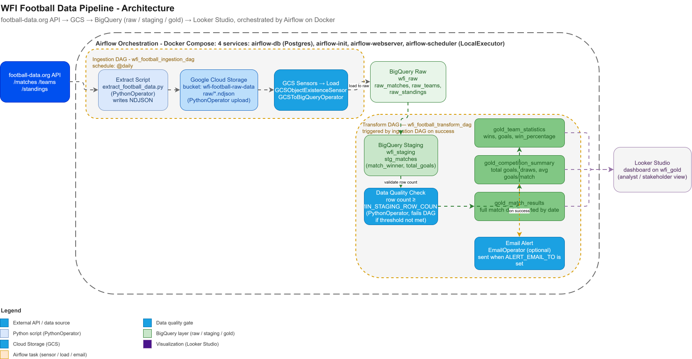

# WFI Football Data Pipeline

## Project Overview

This project is an automated ELT pipeline built for WFI (World Football Intelligence), a sports analytics company that sells football data and insights to clubs, broadcasters and betting platforms. It replaces a manual process of downloading spreadsheets and cleaning them by hand with a cloud-native pipeline that pulls World Cup data from a public API, lands it in cloud storage, loads it into a data warehouse, and transforms it into tables that are ready for analysts and dashboards.

The pipeline runs on a daily schedule with retries and full task history, so the data can be trusted to be fresh and complete without anyone needing to trigger a single step manually.

## Architecture

The pipeline follows a standard ELT pattern with three layers inside BigQuery.




## Three layers, three audiences:

| Layer | Dataset | Used by | Purpose |
|---|---|---|---|
| Raw | wfi_raw | Data engineers | Keep the original API response untouched, in case anything needs to be reprocessed |
| Staging | wfi_staging | Data analysts | Cleaned and standardized records, with derived fields like match winner and total goals |
| Gold | wfi_gold | Business users, dashboards | Pre-aggregated tables that answer specific business questions directly |

GCS sits between the API and BigQuery deliberately. If the BigQuery load step fails, the raw file is still sitting safely in the bucket and can be reloaded without calling the API again, which matters because free API tiers are usually rate limited.

Two Airflow DAGs drive the pipeline. The ingestion DAG extracts data, uploads it to GCS, waits for the files to exist, then loads them into the three raw tables. On success it triggers the transform DAG, which runs the staging query first and then the two gold queries in parallel.

## Project Structure

```
wfi-football-pipeline/
├── README.md
├── requirements.txt              # pinned dependencies for the local venv
├── requirements-airflow.txt      # dependencies installed inside the Airflow image
├── .env.example                  # template for your local .env file
├── .gitignore
├── config.py                     # loads and validates environment variables
├── Dockerfile.airflow            # custom Airflow image with the Google provider
├── docker-compose.yml            # starts the 4 Airflow services
├── scripts/
│   ├── extract_football_data.py  # calls the API, writes NDJSON files
│   └── gcs_upload.py             # uploads NDJSON files to GCS
├── dags/
│   ├── wfi_ingestion_dag.py      # extract, upload, sense, load into wfi_raw
│   └── wfi_transform_dag.py      # runs the SQL files below
├── sql/
│   ├── create_staging_matches.sql
│   ├── create_gold_team_stats.sql
│   └── create_gold_competition_summary.sql
└── data/
    └── raw/                      # local NDJSON output, ignored by git
```

## Prerequisites

Accounts and access:

1. Register at football-data.org and get a free API key.
2. Create a Google Cloud Platform account and a new GCP project.

Local tools:

1. Python 3.10 or newer.
2. Docker Desktop, installed and running.
3. A code editor, VS Code works well for this.
4. The Google Cloud CLI (`gcloud`), see the next section.

## Google Cloud CLI Setup

Everything below can be done through the GCP Console, but the CLI is faster and gives you commands you can copy straight into a terminal rather than clicking through screens each time you spin up a fresh project.

**1. Install the CLI**

- Windows: download the installer from https://cloud.google.com/sdk/docs/install and run it, or via a package manager: `winget install Google.CloudSDK`
- Mac: `brew install --cask google-cloud-sdk`
- Linux: `curl https://sdk.cloud.google.com | bash`

Confirm it installed correctly:

```bash
gcloud --version
```

**2. Authenticate and set your active project**

```bash
gcloud auth login
gcloud config set project YOUR_PROJECT_ID
```

**3. Enable the required APIs**

```bash
gcloud services enable bigquery.googleapis.com storage.googleapis.com
```

Compute Engine API is not required for this setup, only add it if you pursue the cloud-deployment extension:

```bash
gcloud services enable compute.googleapis.com
```

**4. Create the GCS bucket**

```bash
gcloud storage buckets create gs://wfi-football-raw-data --project=YOUR_PROJECT_ID --location=US
```

**5. Create the three BigQuery datasets**

```bash
bq mk --dataset --location=US YOUR_PROJECT_ID:wfi_raw
bq mk --dataset --location=US YOUR_PROJECT_ID:wfi_staging
bq mk --dataset --location=US YOUR_PROJECT_ID:wfi_gold
```

**6. Set up authentication for the pipeline**

Try a real service account key first:

```bash
gcloud iam service-accounts create wfi-pipeline-sa \
  --display-name="WFI Football Pipeline Service Account"

gcloud projects add-iam-policy-binding YOUR_PROJECT_ID \
  --member="serviceAccount:wfi-pipeline-sa@YOUR_PROJECT_ID.iam.gserviceaccount.com" \
  --role="roles/storage.objectViewer"

gcloud projects add-iam-policy-binding YOUR_PROJECT_ID \
  --member="serviceAccount:wfi-pipeline-sa@YOUR_PROJECT_ID.iam.gserviceaccount.com" \
  --role="roles/bigquery.jobUser"

gcloud projects add-iam-policy-binding YOUR_PROJECT_ID \
  --member="serviceAccount:wfi-pipeline-sa@YOUR_PROJECT_ID.iam.gserviceaccount.com" \
  --role="roles/bigquery.dataEditor"

gcloud iam service-accounts keys create service_account.json \
  --iam-account=wfi-pipeline-sa@YOUR_PROJECT_ID.iam.gserviceaccount.com
```

**If that fails with "Service account key creation is disabled"** (common on free-credits accounts under an org policy), use Application Default Credentials instead:

```bash
gcloud auth application-default login
gcloud auth application-default set-quota-project YOUR_PROJECT_ID

# Mac/Linux
cp ~/.config/gcloud/application_default_credentials.json service_account.json
# Windows PowerShell
copy $env:APPDATA\gcloud\application_default_credentials.json service_account.json

gcloud projects add-iam-policy-binding YOUR_PROJECT_ID \
  --member="user:your-email@gmail.com" \
  --role="roles/storage.objectViewer"

gcloud projects add-iam-policy-binding YOUR_PROJECT_ID \
  --member="user:your-email@gmail.com" \
  --role="roles/bigquery.jobUser"

gcloud projects add-iam-policy-binding YOUR_PROJECT_ID \
  --member="user:your-email@gmail.com" \
  --role="roles/bigquery.dataEditor"
```

Either way, `service_account.json` ends up in the project root, already covered by `.gitignore`, and both code paths (`scripts/gcs_upload.py` and the Docker mount) accept either file format transparently.

## Setup Guide

### Step 1: Environment setup

Copy the environment template and fill in your real values.

```bash
cp .env.example .env
```

Open `.env` and set `FOOTBALL_API_KEY` and `GCP_PROJECT_ID` at minimum. Then create and activate a virtual environment.

```bash
python -m venv venv
# Windows (Git Bash)
source venv/Scripts/activate
# Mac or Linux
source venv/bin/activate

pip install -r requirements.txt
```

Confirm Docker Desktop is running before moving on, the later steps depend on it.

### Step 2: Test extraction

This step confirms the API key works and that the extraction logic produces valid files before anything touches the cloud.

```bash
python scripts/extract_football_data.py
```

Expected result: three NDJSON files appear inside `data/raw/`. Open one and check that each line is a valid JSON object with fields like team names and scores.

### Step 3: Test the GCS upload

This step confirms the service account has the right permissions before Airflow relies on it.

```bash
python scripts/gcs_upload.py
```

Check the GCS console for your bucket and confirm the three files appear under the `raw/` prefix. A 403 error here almost always means the service account is missing the Storage Object Viewer role.

### Step 4: Start Airflow with Docker

```bash
docker compose up -d --build
```

This builds the custom Airflow image, then starts four services: `airflow-db` (Postgres metadata store), `airflow-init` (creates the admin user), `airflow-webserver`, and `airflow-scheduler`. Give it two to three minutes to finish initializing.

Open `http://localhost:8080` and log in with `admin` / `admin`. You should see the Airflow UI with no DAGs visible yet, that is expected since the DAG files are mounted but not registered until the scheduler picks them up. If a service fails to start, check the logs.

```bash
docker compose logs
```

### Step 5: Run the ingestion DAG

`PROJECT_ID` and `BUCKET_NAME` are pulled from `config.py` (which reads your `.env`), so there's nothing to edit in the DAG file itself, just make sure `GCP_PROJECT_ID` and `GCS_BUCKET_NAME` are correct in `.env`.

In the Airflow UI, unpause `wfi_football_ingestion_dag` and trigger a manual run. Watch the graph view, tasks should turn green in order: extract, upload, the three sensors, the three BigQuery loads, then the trigger to the transform DAG. If a task turns red, click it and check the logs for the actual error message.

Once it finishes, confirm data landed in BigQuery.

```sql
SELECT COUNT(*) FROM wfi_raw.raw_matches;
SELECT COUNT(*) FROM wfi_raw.raw_teams;
SELECT COUNT(*) FROM wfi_raw.raw_standings;
```

### Step 6: Run the transform DAG

Same as above, the SQL files pull `PROJECT_ID` in from the DAG's `read_sql()` helper at runtime, so nothing needs manual editing here either as long as `.env` is correct. The transform DAG is triggered automatically at the end of the ingestion DAG, but it can also be triggered manually from the Airflow UI to test it in isolation.

Once it finishes, confirm the staging and gold tables have data.

```sql
SELECT * FROM wfi_staging.stg_matches LIMIT 10;
SELECT * FROM wfi_gold.gold_team_statistics ORDER BY win_percentage DESC LIMIT 5;
SELECT * FROM wfi_gold.gold_competition_summary;
```

### Step 7: Validate the full pipeline end to end

Re-trigger `wfi_football_ingestion_dag` from scratch to simulate a fresh daily run and confirm both DAGs complete with every task green. If that holds, the pipeline is working end to end and will keep running on the `@daily` schedule without anyone touching it.

## Key Files

| File | What it does |
|---|---|
| `.env` | Stores secrets and config, read by `config.py` at runtime, never committed |
| `config.py` | Loads `.env` and exposes the values used across every script and DAG |
| `scripts/extract_football_data.py` | Calls the three API endpoints and writes NDJSON files to `data/raw/` |
| `scripts/gcs_upload.py` | Uploads the NDJSON files to the GCS bucket |
| `dags/wfi_ingestion_dag.py` | Extract, upload, sense, load into `wfi_raw`, then trigger the transform DAG |
| `dags/wfi_transform_dag.py` | Runs the three SQL files, a data quality row-count check, and an optional email alert |
| `sql/create_staging_matches.sql` | Cleans `raw_matches`, derives match winner and total goals, writes `stg_matches` |
| `sql/create_gold_team_stats.sql` | Unions home and away rows per team, aggregates wins, goals and win rate |
| `sql/create_gold_competition_summary.sql` | Aggregates total matches, total goals and draws per competition |
| `sql/create_gold_match_results.sql` | Full match detail sorted by date, feeds the Looker Studio table view |
| `docker-compose.yml` | Defines the four Airflow services |
| `Dockerfile.airflow` | Extends the base Airflow image with the Google provider package |

## Common Errors

| Error | Likely cause | Fix |
|---|---|---|
| 403 Permission Denied | Service account missing an IAM role | Add Storage Object Viewer, BigQuery Job User and BigQuery Data Editor |
| ModuleNotFoundError | Virtual env not activated or dependencies not installed | Activate `venv` and rerun `pip install -r requirements.txt` |
| 401 Unauthorized from the API | Missing or wrong API key | Check `FOOTBALL_API_KEY` in `.env`, no quotes, no extra spaces |
| DAG not showing in the UI | Syntax error in the DAG file | Run `python dags/wfi_ingestion_dag.py` locally and read the traceback |
| Sensor times out | File never reached GCS | Confirm `upload_to_gcs` completed successfully before the sensor runs |
| WRITE_TRUNCATE not working | Wrong project, dataset or table name | Double check `PROJECT_ID`, `RAW_DATASET` and the table name match BigQuery exactly |
| `docker compose up` fails | Docker Desktop not running | Start Docker Desktop, wait for it to fully load, then rerun the command |
| Division by zero in SQL | Used `/` instead of `SAFE_DIVIDE()` | Replace with `SAFE_DIVIDE()` anywhere division could hit a zero denominator |

## Extensions

### 1. Looker Studio dashboard on the gold tables

Requirements: nothing extra to install, this connects directly to BigQuery through the browser.

1. Go to https://lookerstudio.google.com and click **Create → Report**.
2. Choose **BigQuery** as the connector, authorize access if prompted, then navigate to your project → `wfi_gold` dataset.
3. Add `gold_team_statistics` as your first data source, then click **Add** to bring it into the report.
4. Build a bar chart: dimension `team_name`, metric `win_percentage`, sorted descending, this is your headline "who's winning" visual.
5. Click **Add a chart** again, this time using `gold_competition_summary` as the source, and add a scorecard for `average_goals_per_match` and another for `total_goals`.
6. Add `gold_match_results` as a third source and add a table view sorted by date, useful as a detail view under the summary charts. See the "Fourth gold table" extension below for how this table is built.
7. To add a second dataset to the same report: **Resource → Manage added data sources → Add a data source**, Looker Studio lets you mix multiple BigQuery tables on one page as long as each chart only pulls from one source at a time (no cross-source joins in the free tier, so keep charts single-source).
8. Share: **File → Share → Publish and embed**, or just share the report link directly, this is what you screenshot for your portfolio.

A thing worth knowing: Looker Studio caches query results for performance, so if you re-run the pipeline and don't see updated numbers immediately, use the refresh icon on the report or wait for the default cache window to expire.

### 2. Data quality check that fails the DAG below a threshold

This one's already wired into the scaffold, `dags/wfi_transform_dag.py` now includes a `validate_staging_row_count` task between `create_staging_matches` and the two gold-layer tasks. It queries `stg_matches` directly with a `bigquery.Client`, compares the row count against `MIN_STAGING_ROW_COUNT`, and raises a `ValueError` if it's too low, which Airflow surfaces as a failed task and halts the DAG before gold tables get built on thin data.

To use it:

1. Set the threshold in `.env`:
   ```
   MIN_STAGING_ROW_COUNT=10
   ```
   Pick a number that reflects what "a normal run" looks like for your competition and date range, a World Cup group stage might reasonably have 30+ matches, so 10 is a conservative floor that still catches a badly broken run.
2. Rebuild so the new env var and DAG code land:
   ```bash
   docker compose up -d --build --force-recreate
   ```
3. Trigger the transform DAG and confirm the new task appears in the graph view between staging and gold.

To see it actually catch something, temporarily set `MIN_STAGING_ROW_COUNT` absurdly high (like `999999`), rerun, and confirm the task fails with your custom error message rather than a generic BigQuery error, that's the difference between "the pipeline broke" and "the pipeline caught a data problem," which is the point of the exercise.

### 3. Email alerting via EmailOperator

Requirements: an SMTP-capable email account. Gmail works well for a personal project as long as you use an App Password rather than your real password (Gmail blocks plain password SMTP login for security).

**If using Gmail:**
1. Turn on 2-Step Verification on your Google account if it isn't already.
2. Go to https://myaccount.google.com/apppasswords and generate an app password for "Mail."
3. Use that generated password, not your normal Gmail password, in the next step.

**Configure `.env`:**

```
ALERT_EMAIL_TO=you@example.com
SMTP_HOST=smtp.gmail.com
SMTP_PORT=587
SMTP_USER=your_email@gmail.com
SMTP_PASSWORD=your_app_password
SMTP_MAIL_FROM=your_email@gmail.com
```

Leaving `ALERT_EMAIL_TO` blank skips the notify task entirely, the DAG checks for it at parse time and only adds the `EmailOperator` task if an address is present, so nothing breaks for anyone who hasn't set up SMTP yet.

**Rebuild and test:**

```bash
docker compose up -d --build --force-recreate
```

Trigger the ingestion DAG (which cascades into transform), and once the full run succeeds, `notify_pipeline_success` fires and sends a summary email with the run ID and completion time. Check your inbox, and if nothing arrives, check the task's logs in the Airflow UI first, most SMTP failures show up clearly there (wrong port, auth rejected, etc) rather than failing silently.

### 4. Fourth gold table: gold_match_results

Full match detail sorted by date, with the derived `match_winner` and `total_goals` columns carried over from staging. This is what the Looker Studio table view in extension 1 reads from.

**Files to add/update:**

| File | Change |
|---|---|
| `sql/create_gold_match_results.sql` | New file. Selects match-level detail from `stg_matches`, ordered by `match_date` |
| `dags/wfi_transform_dag.py` | Adds a `create_gold_match_results` task, runs in parallel with the other two gold tasks after the data quality check passes |

**Steps:**

1. `sql/create_gold_match_results.sql` and the DAG task are already included in this scaffold, nothing to build from scratch, just confirm both files are present:
   ```bash
   cat sql/create_gold_match_results.sql
   grep -n "create_gold_match_results" dags/wfi_transform_dag.py
   ```
2. Rebuild so Airflow picks up the new task:
   ```bash
   docker compose up -d --build --force-recreate
   ```
3. Trigger the transform DAG and confirm `create_gold_match_results` appears in the graph view, running in parallel with `create_gold_team_stats` and `create_gold_competition_summary`.
4. Validate in BigQuery:
   ```sql
   SELECT * FROM wfi_gold.gold_match_results ORDER BY match_date DESC LIMIT 10;
   ```
5. Point Looker Studio at it as described in the dashboard extension above.

### 5. Deploy Airflow to a GCP Compute Engine VM

Requirements: `gcloud` CLI (already installed from the setup section above), Compute Engine API enabled, and your repo pushed somewhere the VM can pull it from (a GitHub repo is simplest).

**Files to update:** none of the pipeline's own files need to change, this is purely infrastructure. The same `docker-compose.yml`, DAGs, and `.env` that run locally run identically on the VM.

**Steps:**

1. Enable the Compute Engine API:
   ```bash
   gcloud services enable compute.googleapis.com
   ```
2. Create a VM with Docker pre-installed via Container-Optimized OS is tempting but fights Compose, a plain Debian/Ubuntu image with Docker installed via startup script is simpler to reason about:
   ```bash
   gcloud compute instances create wfi-airflow-vm \
     --project=YOUR_PROJECT_ID \
     --zone=us-central1-a \
     --machine-type=e2-medium \
     --image-family=debian-12 \
     --image-project=debian-cloud \
     --boot-disk-size=30GB \
     --tags=http-server \
     --metadata=startup-script='#! /bin/bash
   apt-get update
   apt-get install -y docker.io docker-compose-plugin git
   systemctl enable docker
   systemctl start docker'
   ```
3. Open port 8080 so you can reach the Airflow UI (restrict the source range to your own IP if you want this locked down rather than public):
   ```bash
   gcloud compute firewall-rules create allow-airflow-8080 \
     --allow=tcp:8080 \
     --target-tags=http-server \
     --direction=INGRESS
   ```
4. SSH into the VM:
   ```bash
   gcloud compute ssh wfi-airflow-vm --zone=us-central1-a
   ```
5. On the VM, clone your repo and set up the environment file and credentials:
   ```bash
   git clone https://github.com/samuelede/wfi-football-pipeline.git
   cd wfi-football-pipeline
   nano .env   # paste in your real values
   nano service_account.json   # paste in your key, or scp it up separately with gcloud compute scp
   ```
   For the credentials file specifically, `gcloud compute scp` from your local machine is cleaner than pasting a JSON key through an SSH session:
   ```bash
   gcloud compute scp service_account.json wfi-airflow-vm:~/wfi-football-pipeline/service_account.json --zone=us-central1-a
   ```
6. Start the stack, same command as local:
   ```bash
   sudo docker compose up -d --build
   ```
7. Get the VM's external IP and open the Airflow UI from your own browser:
   ```bash
   gcloud compute instances describe wfi-airflow-vm --zone=us-central1-a --format='get(networkInterfaces[0].accessConfigs[0].natIP)'
   ```
   Then visit `http://THAT_IP:8080`.

A few things worth knowing before you commit to this for anything beyond a demo: the VM's external IP changes on restart unless you reserve a static one (`gcloud compute addresses create`), the Airflow UI here has no HTTPS or auth hardening beyond the default admin/admin login, and leaving an `e2-medium` running 24/7 will eat into free credits faster than you'd expect, stopping the VM (`gcloud compute instances stop wfi-airflow-vm`) when you're not actively demoing it is worth doing.

## Contributing

This project was built as a personal data engineering exercise, but suggestions and improvements are welcome.

1. Fork the repository and create a feature branch off `main`.
2. Keep changes scoped, one feature or fix per pull request makes review easier.
3. If you change a SQL model, update the corresponding section in this README so the setup steps stay accurate.
4. Test any DAG changes locally with `docker compose up -d --build` before opening a pull request.
5. Open a pull request with a short description of what changed and why.

Bug reports and questions are also welcome through the issues tab.